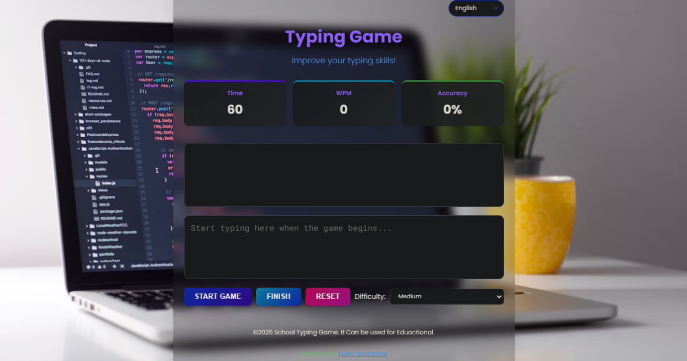

# Multi-Language Typing Game



A responsive typing game that helps users improve their typing skills in multiple languages, including English, Afaan Oromo, Amharic, Tigrigna, and Somali.

## Features

- 🌍 5 supported languages
- 📱 Fully responsive design (mobile & desktop)
- ⏱️ Timed challenges with difficulty levels
- 📊 Detailed performance statistics
- 📈 WPM (Words Per Minute) tracking
- 🎯 Accuracy measurement

## Technologies Used

- HTML5
- CSS3 (with Flexbox and CSS Variables)
- JavaScript (ES6)
- Font Awesome Icons
- Google Fonts

## How to Use

1. Clone the repository:
   ```bash
   git clone https://github.com/luckychera/typing-game.git
